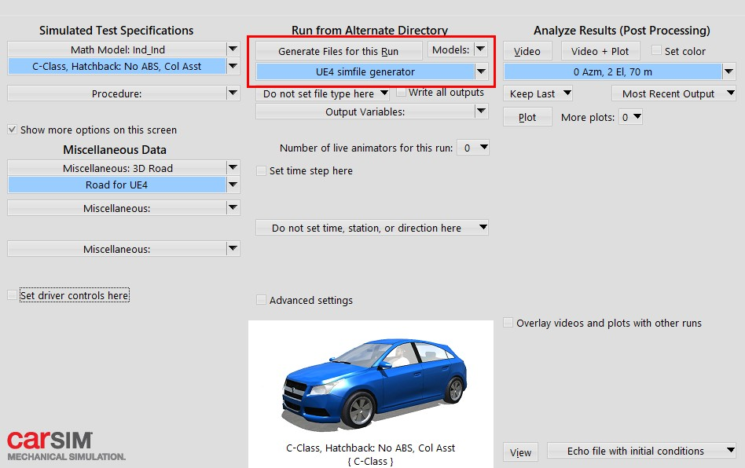

# CARSIM integration (first beta)

CARLA has integrated Carsim so we can forward all vehicle controls to Carsim and let him make all the physics calculations of the vehicle and send back the new state of the vehicle to CARLA.

*   [__Requisites__](#requisites)  
*   [__Prepare Carsim simulation__](#prepare-carsim-simulation)  
	*   [Carsim simulation file](#carsim-simulation-file)  

---
## Requisites

* Carsim software + licence
* Unreal 4.24 plugin: Vehicle dynamics
* CARLA compiled with flag **--carsim** (CARLA packages are Carsim ready)

We need to have a licence for Carsim software setup and running.

For the comunication with Unreal we need to install the plugin in UE called **vehicle dynamics** (it is free)

If you use the CARLA from source, then you need to compile the server part with the **--carsim** flag:
```sh
make CarlaUE4Editor ARGS="--carsim"
```

## Prepare Carsim simulation

* Setup the simulation and generate the .sim file that UE4 plugin needs



For Windows systems, a **.sim** file is like this:

```
SIMFILE

SET_MACRO $(ROOT_FILE_NAME)$ Run_dd7a828d-4b14-4c77-9d09-1974401d6b25
SET_MACRO $(OUTPUT_PATH)$ D:\carsim\Data\Results
SET_MACRO $(WORK_DIR)$ D:\carsim\Data\
SET_MACRO $(OUTPUT_FILE_PREFIX)$ $(WORK_DIR)$Results\Run_dd7a828d-4b14-4c77-9d09-1974401d6b25\LastRun

FILEBASE $(OUTPUT_FILE_PREFIX)$
INPUT $(WORK_DIR)$Results\$(ROOT_FILE_NAME)$\Run_all.par
INPUTARCHIVE $(OUTPUT_FILE_PREFIX)$_all.par
ECHO $(OUTPUT_FILE_PREFIX)$_echo.par
FINAL $(OUTPUT_FILE_PREFIX)$_end.par
LOGFILE $(OUTPUT_FILE_PREFIX)$_log.txt
ERDFILE $(OUTPUT_FILE_PREFIX)$.vs
PROGDIR D:\carsim\
DATADIR D:\carsim\Data\
GUI_REFRESH_V CarSim_RefreshEvent_7760
RESOURCEDIR D:\carsim\\Resources\
PRODUCT_ID CarSim
PRODUCT_VER 2020.0
ANIFILE D:\carsim\Data\runs\animator.par
VEHICLE_CODE i_i
EXT_MODEL_STEP 0.00050000
PORTS_IMP 0
PORTS_EXP 0

DLLFILE D:\carsim\Programs\solvers\carsim_64.dll
END
```
### Simfiles in Ubuntu
For Ubuntu there is no a GUI way to create these files. You need to generate them in Windows and move the related .par, .txt, .vs files to Ubuntu. Then you need to modify the .sim file so that the variables `INPUT`, `INPUTARCHIVE`, `LOGFILE`, etc point towards the same files in your Ubuntu system. Finally, you need to replace the `DLLFILE` line to point towards the CarSim solver which th default installation will be `SOFILE /opt/carsim_2020.0/lib64/libcarsim.so.2020.0`. Your .sim file should similar to this:

```
SIMFILE

FILEBASE /path/to/LastRun
INPUT /path/to/Run_all.par
INPUTARCHIVE /path/to/LastRun_all.par
ECHO /path/to/LastRun_echo.par
FINAL /path/to/LastRun_end.par
LOGFILE /path/to/LastRun_log.txt
ERDFILE /path/to/LastRun.vs
PROGDIR /opt/carsim_2020.0/lib64/
DATADIR .
PRODUCT_ID CarSim
PRODUCT_VER 2020.1
VEHICLE_CODE i_i

SOFILE /opt/carsim_2020.0/lib64/libcarsim.so.2020.0
END
```

* Create a vehicle and enable it for Carsim:

    ```sh
    vehicle.enable_carsim(<path_to_ue4simfile.sim>)
    ```
    Now all controls sent to the vehicle will be forwarded to Carsim, who will update the physics and send back the status of the vehicle (the transform). Once the simulation has finished (or terminated) you can analyze the data with Carsim. 


