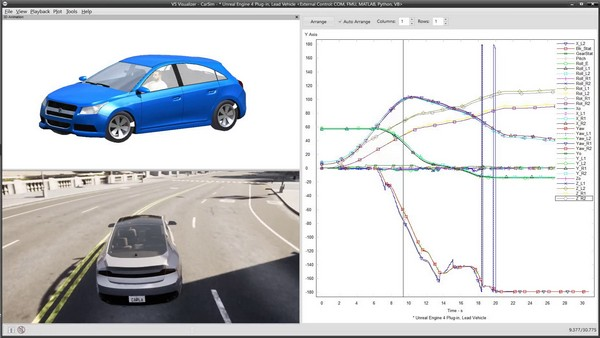

# CARSIM Integration (Beta)

This integration allows CARLA to forward all vehicle controls to CarSim in order to make all 
the physics calculations of the vehicle and send back the new state of the vehicle to CARLA.

*   [__Requisites__](#requisites)  
*   [__Setup Carsim__](#set-up-carsim)  
	*   [__SIM file__](#sim-file)  
        * [__On Windows__](#on-windows)
        * [__On Ubuntu__](#on-ubuntu)
	*   [__Vehicle Sizes__](#vehicle-sizes)  
*   [__Run Simulation__](#run-simulation)  

---
## Requisites

* [CarSim](https://www.carsim.com/products/carsim/index.php) software + licence
* Unreal 4.24 plugin: [Vehicle dynamics](https://www.unrealengine.com/marketplace/en-US/product/carsim-vehicle-dynamics)
* CARLA compiled with flag **--carsim** (CARLA packages are CarSim ready)

It is necessary to have a licence for CarSim software set up and running.

For the communication with Unreal it is necessary to install the free plugin in UE called [**vehicle 
dynamics**](https://www.unrealengine.com/marketplace/en-US/product/carsim-vehicle-dynamics) 

If you use CARLA from source, then you need to compile the server with the **--carsim** flag:
```sh
make CarlaUE4Editor ARGS="--carsim"
```
All packages are already compiled with the **--carsim** flag, so they are ready to use with CarSim.

## Set Up CarSim
#### SIM File

You need to generate the .sim file that describes the simulation to run in both CARLA and 
CarSim. The CarSim plugin needs this file to know about the simulation to run.

##### On Windows

You can use the GUI to generate the file once you have all the parameters configured.


For Windows systems, a **.sim** file looks like this:

```
SIMFILE

SET_MACRO $(ROOT_FILE_NAME)$ Run_dd7a828d-4b14-4c77-9d09-1974401d6b25
SET_MACRO $(OUTPUT_PATH)$ D:\carsim\Data\Results
SET_MACRO $(WORK_DIR)$ D:\carsim\Data\
SET_MACRO $(OUTPUT_FILE_PREFIX)$ $(WORK_DIR)$Results\Run_dd7a828d-4b14-4c77-9d09-1974401d6b25\LastRun

FILEBASE $(OUTPUT_FILE_PREFIX)$
INPUT $(WORK_DIR)$Results\$(ROOT_FILE_NAME)$\Run_all.par
INPUTARCHIVE $(OUTPUT_FILE_PREFIX)$_all.par
ECHO $(OUTPUT_FILE_PREFIX)$_echo.par
FINAL $(OUTPUT_FILE_PREFIX)$_end.par
LOGFILE $(OUTPUT_FILE_PREFIX)$_log.txt
ERDFILE $(OUTPUT_FILE_PREFIX)$.vs
PROGDIR D:\carsim\
DATADIR D:\carsim\Data\
GUI_REFRESH_V CarSim_RefreshEvent_7760
RESOURCEDIR D:\carsim\\Resources\
PRODUCT_ID CarSim
PRODUCT_VER 2020.0
ANIFILE D:\carsim\Data\runs\animator.par
VEHICLE_CODE i_i
EXT_MODEL_STEP 0.00050000
PORTS_IMP 0
PORTS_EXP 0

DLLFILE D:\carsim\Programs\solvers\carsim_64.dll
END
```
##### On Ubuntu
For Ubuntu there is no way to create these files via GUI. You need to generate them in Windows and 
move the related .par, .txt, .vs files to Ubuntu. You then need to modify the .sim file so that the 
variables `INPUT`, `INPUTARCHIVE`, `LOGFILE`, etc point towards the same files in your Ubuntu 
system. Finally, you need to replace the `DLLFILE` line to point towards the CarSim solver which 
in the default installation will be `SOFILE /opt/carsim_2020.0/lib64/libcarsim.so.2020.0`. Your .sim
file should be similar to this:

```
SIMFILE

FILEBASE /path/to/LastRun
INPUT /path/to/Run_all.par
INPUTARCHIVE /path/to/LastRun_all.par
ECHO /path/to/LastRun_echo.par
FINAL /path/to/LastRun_end.par
LOGFILE /path/to/LastRun_log.txt
ERDFILE /path/to/LastRun.vs
PROGDIR /opt/carsim_2020.0/lib64/
DATADIR .
PRODUCT_ID CarSim
PRODUCT_VER 2020.0
VEHICLE_CODE i_i

SOFILE /opt/carsim_2020.0/lib64/libcarsim.so.2020.0
END
```
#### Vehicle Sizes

Care needs to be taken regarding the sizes of vehicles. CarSim lets you specify the dimensions of 
the vehicle to use, but currently there is no correlation between a CarSim vehicle and a CARLA 
vehicle. That means that the vehicles in both parts have different dimensions, and the CARLA vehicle is only used as a placeholder in the simulation.


## Run Simulation

You only need to spawn a CARLA vehicle and enable CarSim on it with the Python API function

```sh
vehicle.enable_carsim(<path_to_ue4simfile.sim>)
```

Now all input controls sent to the vehicle will be forwarded to CarSim, which will update the 
physics and send back the status of the vehicle (the transform) to the CARLA vehicle. 

Once the simulation has finished you can analyze all the data in CarSim as usual. 




