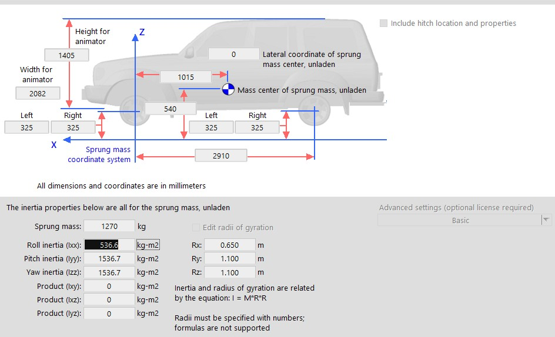

# CARSIM integration (first beta)

CARLA has integrated Carsim so we can forward all vehicle controls to Carsim and let him make all the physics calculations of the vehicle and send back the new state of the vehicle to CARLA.

*   [__Requisites__](#requisites)  
*   [__Setup Carsim__](#setup-carsim)  
	*   [__SIM file__](#sim-file)  
        * [__on Windows__](#on-windows)
        * [__on Ubuntu__](#on-ubuntu)
	*   [__Vehicle sizes__](#vehicle-sizes)  
*   [__Run simulation__](#run-simulation)  

---
## Requisites

* Carsim software + licence
* Unreal 4.24 plugin: Vehicle dynamics
* CARLA compiled with flag **--carsim** (CARLA packages are Carsim ready)

We need to have a licence for Carsim software setup and running.

For the comunication with Unreal we need to install the plugin in UE called **vehicle dynamics** (it is free)

If you use CARLA from source, then you need to compile the server part with the **--carsim** flag:
```sh
make CarlaUE4Editor ARGS="--carsim"
```
All packages are already compiled with the **--carsim**, so they are ready to use with Carsim.

## Setup Carsim
#### SIM file

We need to generate the .sim file that describes the simulation to run in both parts (CARLA and Carsim). The Carsim plugin needs this file to know about the simulation to run.

##### on Windows

You can use the GUI to generate the file once you have all the parameters configured.


For Windows systems, a **.sim** file is like this:

```
SIMFILE

SET_MACRO $(ROOT_FILE_NAME)$ Run_dd7a828d-4b14-4c77-9d09-1974401d6b25
SET_MACRO $(OUTPUT_PATH)$ D:\carsim\Data\Results
SET_MACRO $(WORK_DIR)$ D:\carsim\Data\
SET_MACRO $(OUTPUT_FILE_PREFIX)$ $(WORK_DIR)$Results\Run_dd7a828d-4b14-4c77-9d09-1974401d6b25\LastRun

FILEBASE $(OUTPUT_FILE_PREFIX)$
INPUT $(WORK_DIR)$Results\$(ROOT_FILE_NAME)$\Run_all.par
INPUTARCHIVE $(OUTPUT_FILE_PREFIX)$_all.par
ECHO $(OUTPUT_FILE_PREFIX)$_echo.par
FINAL $(OUTPUT_FILE_PREFIX)$_end.par
LOGFILE $(OUTPUT_FILE_PREFIX)$_log.txt
ERDFILE $(OUTPUT_FILE_PREFIX)$.vs
PROGDIR D:\carsim\
DATADIR D:\carsim\Data\
GUI_REFRESH_V CarSim_RefreshEvent_7760
RESOURCEDIR D:\carsim\\Resources\
PRODUCT_ID CarSim
PRODUCT_VER 2020.0
ANIFILE D:\carsim\Data\runs\animator.par
VEHICLE_CODE i_i
EXT_MODEL_STEP 0.00050000
PORTS_IMP 0
PORTS_EXP 0

DLLFILE D:\carsim\Programs\solvers\carsim_64.dll
END
```
##### on Ubuntu
For Ubuntu there is no a GUI way to create these files. You need to generate them in Windows and move the related .par, .txt, .vs files to Ubuntu. Then you need to modify the .sim file so that the variables `INPUT`, `INPUTARCHIVE`, `LOGFILE`, etc point towards the same files in your Ubuntu system. Finally, you need to replace the `DLLFILE` line to point towards the CarSim solver which th default installation will be `SOFILE /opt/carsim_2020.0/lib64/libcarsim.so.2020.0`. Your .sim file should be similar to this:

```
SIMFILE

FILEBASE /path/to/LastRun
INPUT /path/to/Run_all.par
INPUTARCHIVE /path/to/LastRun_all.par
ECHO /path/to/LastRun_echo.par
FINAL /path/to/LastRun_end.par
LOGFILE /path/to/LastRun_log.txt
ERDFILE /path/to/LastRun.vs
PROGDIR /opt/carsim_2020.0/lib64/
DATADIR .
PRODUCT_ID CarSim
PRODUCT_VER 2020.0
VEHICLE_CODE i_i

SOFILE /opt/carsim_2020.0/lib64/libcarsim.so.2020.0
END
```
#### Vehicle sizes

Some mention need to be done about the vehicles sizes. Carsim let you specify each dimension of the vehicle to use, but currently there is no correspondence between a Carsim vehicle and a CARLA vehicle. That means that the vehicles in both parts have different dimensions, and the CARLA vehicle is only used as a placeholder in the simulation.



## Run simulation

You only need to spawn a CARLA vehicle and enable Carsim on that with the Python API function

```sh
vehicle.enable_carsim(<path_to_ue4simfile.sim>)
```

Now all input controls sent to the vehicle will be forwarded to Carsim, who will update the physics and send back the status of the vehicle (the transform) back to the CARLA vehicle. 

Once the simulation has finished you can analyze all the data in Carsim as usually. 


