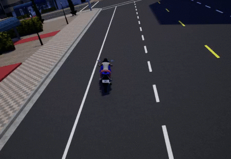
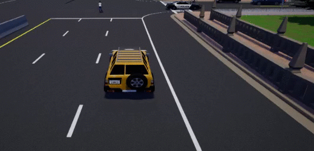

### Recording and Replaying system

CARLA includes now a recording and replaying API, that allows to record a simulation in a file and later replay that simulation. The file is written on server side only, and it includes which **actors are created or destroyed** in the simulation, the **state of the traffic lights** and the **position/orientation** of all vehicles and pedestrians.

All data is written in a binary file on the server. We can use filenames with or without a path. If we specify a filename without any of '\\', '/' or ':' characters, then it is considered to be only a filename and will be saved on folder **CarlaUE4/Saved**. If we use any of the previous characters then the filename will be considered as an absolute filename with path (for example: '/home/carla/recording01.log' or 'c:\\records\\recording01.log').

As an estimate, a simulation with about 150 actors (50 traffic lights, 100 vehicles) for 1h of recording takes around 200 Mb in size.

#### Recording
To start recording we only need to supply a file name:

```py
client.start_recorder("recording01.log")
```

To stop the recording, we need to call:

```py
client.stop_recorder()
```
#### Playback

At any point we can replay a simulation, specifying the filename:

```py
client.replay_file("recording01.log")
```
The replayer replicates the actor and traffic light information of the recording each frame.

When replaying we have some other options that we can use, the full API call is:

```py
client.replay_file("recording01.log", start, duration, camera)
```
* **start**: time we want to start the simulation.
  * If the value is positive, it means the number of seconds from the beginning.
  Ex: a value of 10 will start the simulation at second 10.
  * If the value is negative, it means the number of seconds from the end.
  Ex: a value of -10 will replay only the last 10 seconds of the simulation.
* **duration**: we can say how many seconds we want to play. If the simulation has not reached the end, then all actors will have autopilot enabled automatically. The intention here is to allow for replaying a piece of a simulation and then let all actors start driving in autopilot again.
* **camera**: we can specify the Id of an actor and then the camera will follow that actor while replaying. Continue reading to know which Id has an actor.

#### Playback time factor (speed)

We can specify the time factor (speed) for the replayer at any moment, using the next API:

```py
client.set_replayer_time_factor(2.0)
```
A value greater than 1.0 will play in fast motion, and a value below 1.0 will play in slow motion, being 1.0 the default value for normal playback.
As a performance trick, with values over 2.0 the interpolation of positions is disabled.

Also the animations can remain at normal speed, because they don't replicate the state of the animation at that exact frame. So animations are not accurate right now.

The call of this API will not stop the replayer in course, it will change just the speed, so you can change that several times while the replayer is running.

#### Info about the recorded file

We can get details about a recorded simulation, using this API:

```py
client.show_recorder_file_info("recording01.log")
```

The output result is something like this:

```
Version: 1
Map: Town05
Date: 02/21/19 10:46:20

Frame 1 at 0 seconds
 Create 2190: spectator (0) at (-260, -200, 382.001)
 Create 2191: traffic.traffic_light (3) at (4255, 10020, 0)
 Create 2192: traffic.traffic_light (3) at (4025, 7860, 0)
 Create 2193: traffic.traffic_light (3) at (1860, 7975, 0)
 Create 2194: traffic.traffic_light (3) at (1915, 10170, 0)
 ...
 Create 2258: traffic.speed_limit.90 (0) at (21651.7, -1347.59, 15)
 Create 2259: traffic.speed_limit.90 (0) at (5357, 21457.1, 15)
 Create 2260: traffic.speed_limit.90 (0) at (858, 18176.7, 15)
Frame 2 at 0.0254253 seconds
 Create 2276: vehicle.mini.cooperst (1) at (4347.63, -8409.51, 120)
  number_of_wheels = 4
  object_type =
  color = 255,241,0
  role_name = autopilot
Frame 4 at 0.0758538 seconds
 Create 2277: vehicle.diamondback.century (1) at (4017.26, 14489.8, 123.86)
  number_of_wheels = 2
  object_type =
  color = 50,96,242
  role_name = autopilot
Frame 6 at 0.122666 seconds
 Create 2278: vehicle.seat.leon (1) at (3508.17, 7611.85, 120.002)
  number_of_wheels = 4
  object_type =
  color = 237,237,237
  role_name = autopilot
Frame 8 at 0.171718 seconds
 Create 2279: vehicle.diamondback.century (1) at (3160, 3020.07, 120.002)
  number_of_wheels = 2
  object_type =
  color = 50,96,242
  role_name = autopilot
Frame 10 at 0.219568 seconds
 Create 2280: vehicle.bmw.grandtourer (1) at (-5405.99, 3489.52, 125.545)
  number_of_wheels = 4
  object_type =
  color = 0,0,0
  role_name = autopilot
Frame 2350 at 60.2805 seconds
 Destroy 2276
Frame 2351 at 60.3057 seconds
 Destroy 2277
Frame 2352 at 60.3293 seconds
 Destroy 2278
Frame 2353 at 60.3531 seconds
 Destroy 2279
Frame 2354 at 60.3753 seconds
 Destroy 2280

Frames: 2354
Duration: 60.3753 seconds
```
From here we know the **date** and the **map** where the simulation was recorded.
Then for each frame that has an event (create or destroy an actor, collisions) it shows that info. For creating actors we see the **Id** it has and some info about the actor to create. This is the **id** we need to specify in the **camera** option when replaying if we want to follow that actor during the replay.
At the end we can see the **total time** of the recording and also the number of **frames** that were recorded.

#### Info about collisions

In simulations whith a **hero actor** the collisions are automatically saved, so we can query a recorded file to see if any **hero actor** had collisions with some other actor. Currently the actor types we can use in the query are these:

* **h** = Hero
* **v** = Vehicle
* **w** = Walker
* **t** = Traffic light
* **o** = Other
* **a** = Any

The collision query needs to know the type of actors involved in the collision. If we don't care we can specify **a** (any) for both. These are some examples:

* **a** **a**: will show all collisions recorded
* **v** **v**: will show all collisions between vehicles
* **v** **t**: will show all collisions between a vehicle and a traffic light
* **v** **w**: will show all collisions between a vehicle and a walker
* **v** **o**: will show all collisions between a vehicle and other actor, like static meshes
* **h** **w**: will show all collisions between a hero and a walker

Currently only **hero actors** record the collisions, so first actor will be a hero always.

The API for querying the collisions is:

```py
client.show_recorder_collisions("recording01.log", "a", "a")
```

The output is something similar to this:

```
Version: 1
Map: Town05
Date: 02/19/19 15:36:08

    Time  Types     Id Actor 1                                 Id Actor 2
      16   v v     122 vehicle.yamaha.yzf                     118 vehicle.dodge_charger.police
      27   v o     122 vehicle.yamaha.yzf                       0

Frames: 790
Duration: 46 seconds
```

We can see there for each collision the **time** when happened, the **type** of the actors involved, and the **id and description** of each actor.

So, if we want to see what happened on that recording for the first collision where the hero actor was colliding with a vehicle, we could use this API:

```py
client.replay_file("col2.log", 13, 0, 122)
```
We have started the replayer just a bit before the time of the collision, so we can see how it happened.
Also, a value of 0 for the **duration** means to replay all the file (it is the default value).

We can see something like this then:



#### Info about blocked actors

There is another API to get information about actors that has been blocked by something and can not follow its way. That could be good to find incidences in the simulation. The API is:

```py
client.show_recorder_actors_blocked("recording01.log", min_time, min_distance)
```

The parameters are:
* **min_time**: the minimum time that an actor needs to be stopped to be considered as blocked (in seconds).
* **min_distance**: the minimum distance to consider an actor to be stopped (in cm).

So, if we want to know which actor is stopped (moving less than 1 meter during 60 seconds), we could use something like:

```py
client.show_recorder_actors_blocked("col3.log", 60, 100)
```

The result can be something like (it is sorted by the duration):

```
Version: 1
Map: Town05
Date: 02/19/19 15:45:01

    Time     Id Actor                                 Duration
      36    173 vehicle.nissan.patrol                      336
      75    104 vehicle.dodge_charger.police               295
      75    214 vehicle.chevrolet.impala                   295
     234     76 vehicle.nissan.micra                       134
     241    162 vehicle.audi.a2                            128
     302    143 vehicle.bmw.grandtourer                     67
     303    133 vehicle.nissan.micra                        67
     303    167 vehicle.audi.a2                             66
     302     80 vehicle.nissan.micra                        67

Frames: 6985
Duration: 374 seconds
```

This lines tell us when an actor was stopped for at least the minimum time specified.
For example the 6th line, the actor 143, at time 302 seconds, was stopped for 67 seconds.

We could check what happened that time with the next API command:

```py
client.replay_file("col3.log", 302, 0, 143)
```


We see there is some mess there that actually blocks the actor (red vehicle in the image).
We can check also another actor with:

```py
client.replay_file("col3.log", 75, 0, 104)
```


We can see it is the same incidence but from another actor involved (police car).

The result is sorted by duration, so the actor that is blocked for more time comes first. We could check the first line, with Id 173 at time 36 seconds it get stopped for 336 seconds. We could check how it arrived to that situation replaying a few seconds before time 36.

```py
client.replay_file("col3.log", 34, 0, 173)
```



We can see then the responsible of the incident.

### Sample Python scripts

There are some scripts you could use:

* **start_recording.py**: this will start recording, and optionally you can spawn several actors and define how much time you want to record.
  * **-f**: filename to write
  * **-n**: vehicles to spawn (optional, 10 by default)
  * **-t**: duration of the recording (optional)
<br>
* **start_replaying.py**: this will start a replay of a file. We can define the starting time, duration and also an actor to follow.
  * **-f**: filename
  * **-s**: starting time (optional, by default from start)
  * **-d**: duration (optional, by default all)
  * **-c**: actor to follow (id) (optional)
<br>
* **show_recorder_file_info.py**: this will show all the information recorded in file. It has two modes of detail, by default it only shows the frames where some event is recorded, the second is showing info about all frames (all positions and trafficlight states).
  * **-f**: filename
  * **-a**: flag to show all details (optional)
<br>
* **show_recorder_collisions.py**: this will show all the collisions hapenned while recording (currently only involved by hero actors).
  * **-f**: filename
  * **-t**: two letters definning the types of the actors involved, for example: -t aa
    * **h** = Hero
    * **v** = Vehicle
    * **w** = Walker
    * **t** = Traffic light
    * **o** = Other
    * **a** = Any
<br>
* **show_recorder_actors_blocked.py**: this will show all the actors that are blocked (stopped) in the recorder. We can define the time and distance to be considered as blocked.
  * **-f**: filename
  * **-t**: minimum seconds stopped to be considered as blocked (optional)
  * **-d**: minimum distance to be considered stopped (optional)


