## Recorder Binary File Format

The recorder system saves all the info needed to replay the simulation in a binary file, using little endian byte order for the multibyte values. A detailed view of the file format follows as a quick view. Each part will be explained in the following sections:

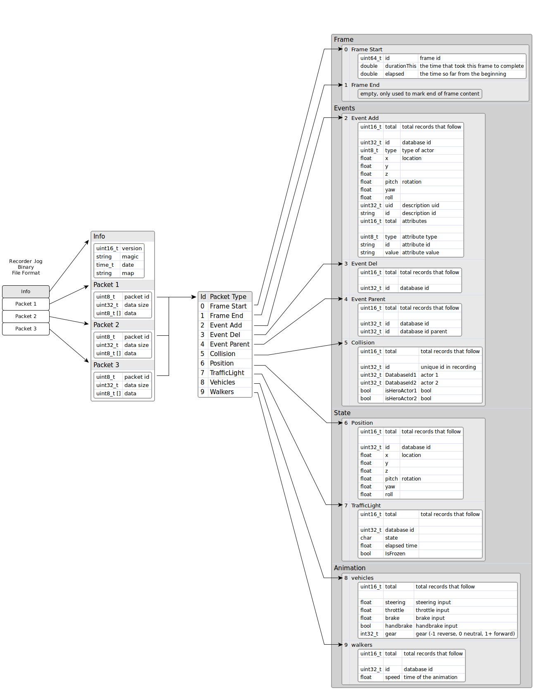

In summary, the file format has a small header with general info (version, magic string, date and the map used) and a collection of packets of different types (currently we use 8 types, but that will be growing in the future).

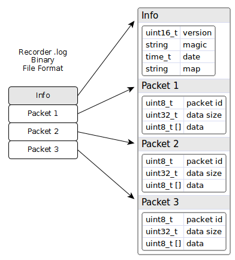

### 1. Strings in binary

Strings are saved with the length of the string first, and then the characters, without ending with a null. For example the string 'Town06' will be saved as hex values: 06 00 54 6f 77 6e 30 36

### 2. Info header

The info header only has general information about the recorded file, like the version and a magic string to identify the file as a recorder file. If the header changes then the version will change also. Next is a date timestamp, with the number of seconds from the Epoch 1900, and then a string with the name of the map used, like 'Town04'.

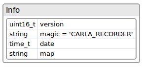

A sample info header is:

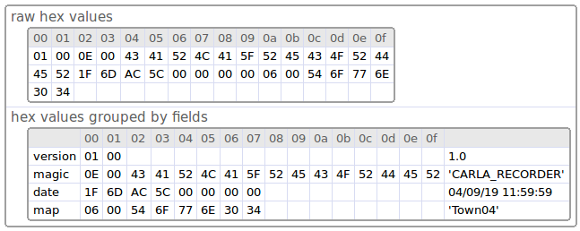

### 3. Packets

Each packet starts with a little header of two fields (5 bytes):

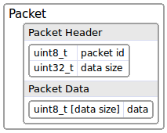

* **id**: is the type of the packet
* **size**: is the size of the data that has the packet
* **data**: data bytes of the packet (optional)

If the **size** is greater than 0 means that the packet has **data** bytes. The **data** is optional, and it needs to be reinterpreted in function of the type of the packet.

The header of the packet is useful because we can just ignore those packets we are not interested in when doing playback. We only need to read the header (first 5 bytes) of the packet and jump to the next packet just skipping the data of the packet:

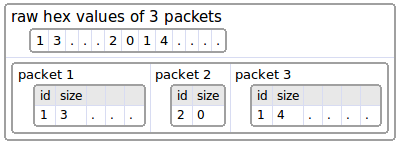

The types of packets are:

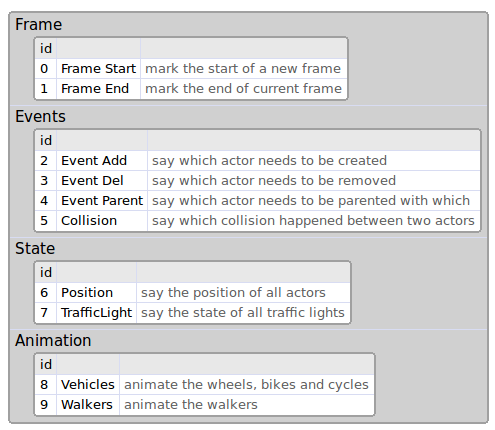

I suggest to use **id** over 100 for user custom packets, because this list will grow in the future in sequence.

#### 3.1 Packet 0: Frame Start

This packet marks the start of a new frame, so it will need to be the first one to start each frame. All packets need to be placed between a **Frame Start** and a **Frame End**.

So, elapsed + durationThis = elapsed time for next frame

#### 3.2 Packet 1: Frame End

This frame has no data and it only marks the end of the current frame. That helps replayer to know the end of each frame just before the new one starts.
Usually the next frame should be a Frame Start packet to start a new frame.

#### 3.3 Packet 2: Event Add

This packet sais how many actors we need to create at current frame.

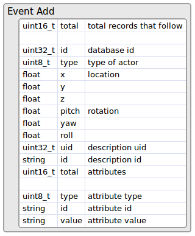

The field **total** sais how many records follow. Each record starts with the **id** field, that is the id the actor has when it was recorded (on playback that id could change internally, but we need to use this id ). The **type** of actor is one value of:

  * 0 = Other
  * 1 = Vehicle
  * 2 = Walker
  * 3 = TrafficLight
  * 4 = INVALID

Next follows the **location** and the **rotation** where we want to create the actor.

Then we have the **description** of the actor. The description **uid** is the numeric id of the description and the **id** is the textual id, like 'vehicle.seat.leon'.

Then comes a collection of its **attributes** (like the color, number of wheels, role, ...). The number of attributes is variable and could be something like:

* number_of_wheels = 4
* sticky_control = true
* color = 79,33,85
* role_name = autopilot

#### 3.4 Packet 3: Event Del

This packet sais how many actors need to be destroyed this frame.

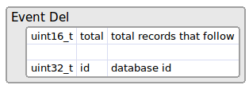

It has the **total** of records, and each record has the **id** of the actor to remove.

For example, this packet could be like this:

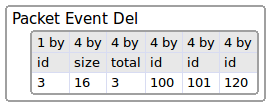

The 3 identify the packet as (Event Del). The 16 is the size of the data of the packet (4 fields of 4 bytes each). So if we don't want to process this packet, we could skip the next 16 bytes and will be directly to the start of the next packet.
The next 3 sais the total records that follows, and each record is the id of the actor to remove. So, we need to remove at this frame the actors 100, 101 and 120.

#### 3.5 Packet 4: Event Parent

This packet sais which actor is the child of another (the parent).

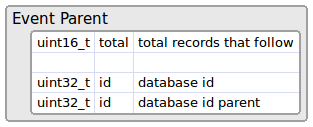

The first id is the child actor, and the second one will be the parent actor.

#### 3.6 Packet 5: Event Collision

If a collision happens between two actors, it will be registered in this packet. Currently only actors with a collision sensor will report collisions, so currently only hero vehicles has that sensor attached automatically.

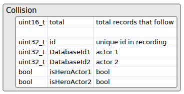

The **id** is just a sequence to identify each collision internally.
Several collisions between the same pair of actors can happen in the same frame, because physics frame rate is fixed and usually there are several in the same render frame.

#### 3.7 Packet 6: Position

This packet records the position and orientation of all actors of type **vehicle** and **walker** that exist in the scene.

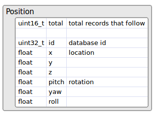

#### 3.8 Packet 7: TrafficLight

This packet records the state of all **traffic lights** in the scene. That means to store the state (red, orange or green) and the time it is waitting to change to a new state.

### 4. File Layout

The layout of the file starts with the **info header** and then follows a collection of packets in groups. The first in each group is the **Frame Start** packet, and the last in the group is the **Frame End** packet. In the middle can go all other packets.

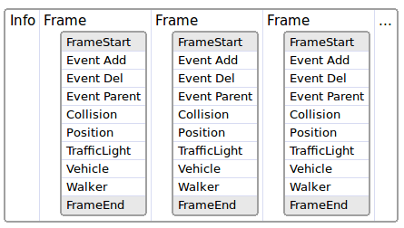

Usually it is a good idea to have all packets about events first, and then the packets about position and state later.

The events packets are optional, only appears when they happen, so we could have a layout like this:

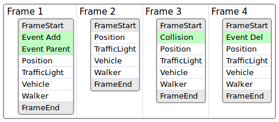

