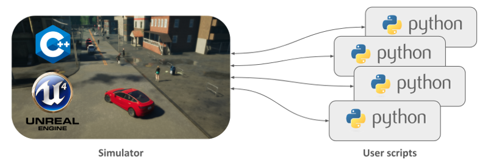

# CARLA

!!! important
    This documentation refers to the latest development versions of CARLA, 0.9.0 or
    later. There is another documentation for the stable version 0.8 [here](https://carla.readthedocs.io/en/stable/getting_started/), though it should only be used for specific queries. 

CARLA is an open-source autonomous driving simulator. It was built from scratch to serve as a modular and flexible API to address a range of tasks involved in the problem of autonomous driving. One of the main goals of CARLA is to help democratize autonomous driving R&D, serving as a tool that can be easily accessed and customized by users. To do so, the simulator has to meet the requirements of different use cases within the general problem of driving (e.g. learning driving policies, training perception algorithms, etc.). CARLA is grounded on Unreal Engine to run the simulation and uses the OpenDRIVE standard (1.4 as today) to define roads and urban settings. Control over the simulation is granted through an API handled in Python and C++ that is constantly growing as the project does.    
  
In order to smooth the process of developing, training and validating driving systems, CARLA evolved to become an ecosystem of projects, built around the main platform by the community. In this context, it is important to understand some things about how does CARLA work, so as to fully comprehend its capabilities.

---
## The simulator

The CARLA simulator consists of a scalable client-server architecture.  
The server is responsible of everything related with the simulation itself: sensor rendering, computation of physics, updates on the world-state and its actors and much more. As it aims for realistic results, the best fit would be running the server with a dedicated GPU, especially when dealing with machine learning.  
The client side consists of a sum of client modules controlling the logic of actors on scene and setting world conditions. This is achieved by leveraging the CARLA API (in Python or C++), a layer that mediates between server and client that is constantly evolving to provide new functionalities.

That summarizes the basic structure of the simulator. Understanding CARLA though is much more than that, as many different features and elements coexist within it. Some of these are listed hereunder, as to gain perspective on the capabilities of what CARLA can achieve. 

* __Traffic manager.__ A built-in system that takes control of the vehicles besides the one used for learning. It acts as a conductor provided by CARLA to recreate urban-like environments with realistic behaviours.  
* __Sensors.__ Vehicles rely on them to dispense information of their surroundings. In CARLA they are a specific kind of actor attached the vehicle and the data they receive can be retrieved and stored to ease the process. Currently the project supports different types of these, from cameras to radars, lidar and many more.  
* __Recorder.__ This feature is used to reenact a simulation step by step for every actor in the world. It grants access to any moment in the timeline anywhere in the world, making for a great tracing tool.  
* __ROS bridge and Autoware implementation.__ As a matter of universalization, the CARLA project ties knots and works for the integration of the simulator within other learning environments.  
* __Open assets.__ CARLA facilitates different maps for urban settings with control over weather conditions and a blueprint library with a wide set of actors to be used. However, these elements can be customized and new can be generated following simple guidelines.  
* __Scenario runner.__ In order to ease the learning process for vehicles, CARLA provides a series of routes describing different situations to iterate on. These also set the basis for the [CARLA challenge](https://carlachallenge.org/), open for everybody to test their solutions and make it to the leaderboard.  

---
## The project

CARLA grows fast and steady, widening the range of solutions provided and opening the way for the different approaches to autonomous driving. It does so while never forgetting its open-source nature. The project is transparent, acting as a white box where anybody is granted access to the tools and the development community. In that democratization is where CARLA finds its value.  
Talking about how CARLA grows means talking about a community of developers who dive together into the thorough question of autonomous driving. Everybody is free to explore with CARLA, find their own solutions and then share their achievements with the rest of the community.  
  
This documentation will be a companion along the way. The next page contains __[Quick start](start_quickstart.md)__ instructions for those eager to install a CARLA release. There is also a build guide for Linux and Windows. This will make CARLA from repository and allow to dive full-length into its features. 

Welcome to CARLA.

<a href="../build_linux" target="_blank" class="btn btn-neutral" title="Go to the latest CARLA release">
<b>Linux</b> build</a>

<a href="../build_windows" target="_blank" class="btn btn-neutral" title="Go to the latest CARLA release">
<b>Windows</b> build</a>

